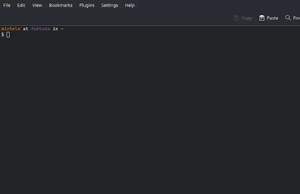

# `msm`: a minimal snippet manager for the shell

`msm` enables you to interactively capture command snippets from your terminal
and recall them using [`fzf`](https://github.com/junegunn/fzf).

For `fish`, read [here](fish/README.md).

## Why to use a snippet manager in your shell

To recall complex commands, you could use use the history, using `reverse-i-search`
or `fzf`, maybe adding a comment to your command, as follows:

```sh
echo my snippet # searchable description
```

There are some problems with this approach:
- The history tends to get really messy after a while
- The history serves another purpose: to recall *recent* commands
- This approach forces you to remove size limits on your history

Separating the snippet store from the history, enables you to use the history
as a transient working memory, and maintain at the same time a curated list
of snippets.

`msm` gives you more than this:
- [Multiline snippets](#multiline-snippets)
- When searching, the selected snippet is [injected in the command line](#snippet-injection)
  (it does not replace the whole buffer)
- `fzf` integration: the preview will show the full multiline snippet
- `bat` integration: syntax highlighted output and preview
- [Multiple snippet stores](#using-multiple-snippet-stores): they are plain-text
  files that you can edit with your editor

## Installation

```sh
git clone https://github.com/mnalli/msm.git --depth=1 ~/.msm
```

*Note*: instead of `~/.msm/` you can use the path you prefer.

## Configuration

Source `msm.sh` and your specific shell bindings in your `.rc` file.

```sh
# bash
eval "$(cat ~/.msm/msm.{sh,bash})"

# zsh
eval "$(cat ~/.msm/msm.{sh,zsh})"
```

Also, define key bindings for interactive functions:

```sh
# bash - suggested bindings: Alt-a, Alt-z
bind -x '"\ea": msm_capture'
bind -x '"\ez": msm_recall'

# zsh - suggested bindings: Ctrl-t, Ctrl-z
bindkey '^t' msm_capture
bindkey '^z' msm_recall
```

You can customize the behavior of `msm` by defining following variables:

```sh
# command used to preview snippets (default: cat)
MSM_PREVIEW='batcat --decorations=never --color=always -l bash'
# location of the snippet store file (default: ~/snippets.sh)
MSM_STORE=~/.local/share/bash/snippets.sh
```

### `fzf` UI configuration

You can customize the `fzf` UI using the following variables. The followings
are their default values:

```sh
# fzf --preview-window flag
MSM_FZF_PREVIEW_WINDOW=''
# fzf --layout flag
MSM_FZF_LAYOUT='default'
```

#### Suggested configuration 1

If you rarely use multiline snippet, you could place `fzf` preview window at the
bottom, using the full horizontal length, and giving 3 lines to it: 1 for the
description and 2 for the definition.

```sh
MSM_FZF_PREVIEW_WINDOW='down:3'
# MSM_FZF_LAYOUT='default'
```

#### Suggested configuration 2

If you often use multiline snippets, you could use the default preview window
(right-half of the terminal) and filter the list at the top of the screen.

```sh
# MSM_FZF_PREVIEW_WINDOW=''
MSM_FZF_LAYOUT='reverse'
```

## Usage

- **Capture**: capture current content of your command line and add it to the snippet store file
- **Recall**: fuzzy search your snippets and insert the selected one in the command line

To modify your snippets, edit your snippet store directly with your favorite editor:

```sh
vim $MSM_STORE
```

Always leave one or more empty lines between one snippet and the other. You can
run `msm validate` to validate the snippet store after you modified it.

## Snippet format

- **Description**: comment at the beginning of the snippet
    - One-line only
    - The description will be fuzzy-searched for during recall
    - **Optional**: if not provided, a default empty one will be added
- **Definition**
    - Can be of multiple lines
    - No empty lines allowed

## Commandline interface

`msm` has a simple command-line interface.

```sh
# view all subcommands
msm help

# validate snippet store (useful if you modified the file manually)
msm validate
```

## Tutorial



Write the snippet in your command line and then use `Alt-a` to **add** the snippet to the store.

For example, type the following:

```sh
git rebase -i
```

Now, press `Alt-a`. The command-line should disappear and if you open the
snippet store at `$MSM_STORE` you should see the newly stored snippet, after
an empty description (added by default):

```sh
#
git rebase -i

```

### Multiline snippets

If you want to be able to specify a description or to add multiline snippets, you
must be able to **insert newline characters** in your command line. Shells like
`zsh` or `fish` can do this by default (with `Alt-Enter`), but `bash` cannot.
View [here](https://github.com/mnalli/insert_newline.bash) how to add this behavior.

The followings are valid snippets:

```sh
# interactive rebase
git rebase -i
```

```sh
# multiline snippet example
echo this is a
echo multiline snippet
```

### Snippet injection

If you recall a snippet, `msm` will insert it under the cursor in your current
command line. Here are some examples ('_' is the cursor location):

```sh
# recall command that generates a stream
less -f <(_)

# recall hard to remember path
ls _
```

## Using multiple snippet stores

It is possible to configure multiple snippet stores.

```sh
# use echo subcommand to expand `~`
MSM_STORE=$(echo ~/snippets.sh ~/system.path)
```

- During search, `msm` will filter results from all the stores.
- When capturing a snippet, `msm` will store it in the **master store**, which
  is the first one in the list, i.e. `~/snippets.sh`. If you wish to move it to
  another store, you can do it manually.

Here's how you can easily interact with different stores:

```sh
# open all stores in vim
vim $MSM_STORE

# open second store
vim $(echo $MSM_STORE | cut -d ' ' -f2)
```
